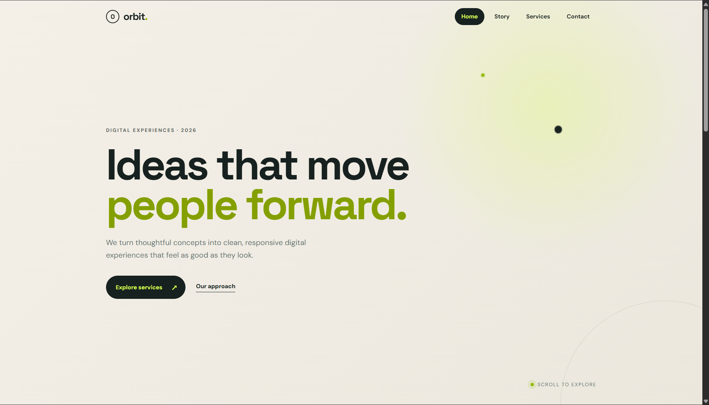

# Orbit — Responsive Landing Page

A modern and responsive landing page developed as part of **SkillCraft Technology Web Development Task 01**.

## 🌐 Live Demo

**[View Live Website](https://rudreshh07-jpg.github.io/SCT_WD_1/)**

## 📸 Screenshots

### Home Section



### Story Section

.png)

### Services Section

.png)

## 🎯 Task Objective

Create an interactive navigation menu that remains fixed while scrolling and changes its style when the user scrolls or hovers over a menu item.

## ✨ Features

* Fixed navigation bar
* Scroll-based navigation styling
* Active section highlighting
* Hover effects on navigation items
* Smooth scrolling
* Responsive design
* Mobile-friendly navigation
* Modern landing page UI

## 🛠️ Technologies Used

* HTML5
* CSS3
* JavaScript

## 📂 Project Structure

```text
SCT_WD_1/
│
├── index.html
├── style.css
├── script.js
├── README.md
├── home.png
├── story.png
└── services.png
```

## ▶️ How to Run

1. Clone or download this repository.
2. Open the project folder.
3. Make sure `index.html`, `style.css`, and `script.js` are in the same folder.
4. Open **`index.html`** in a web browser.
5. Use the navigation menu to move between the different sections.
6. Scroll through the page to see the navigation style change.

No additional installation or packages are required.

## 📋 Task Information

**Organization:** SkillCraft Technology
**Task:** Task 01 — Responsive Landing Page
**Domain:** Web Development

## 👨‍💻 Author

**G Naga Rudresh**

Computer Science Engineering Student
